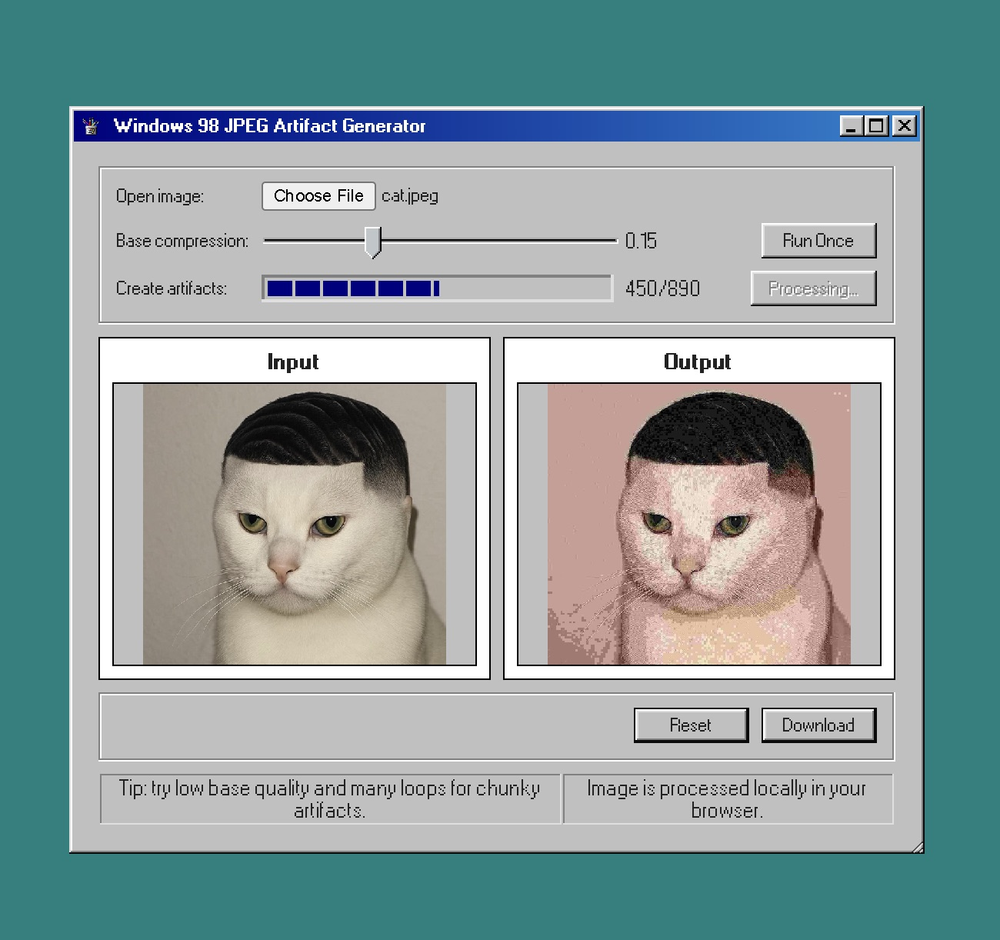
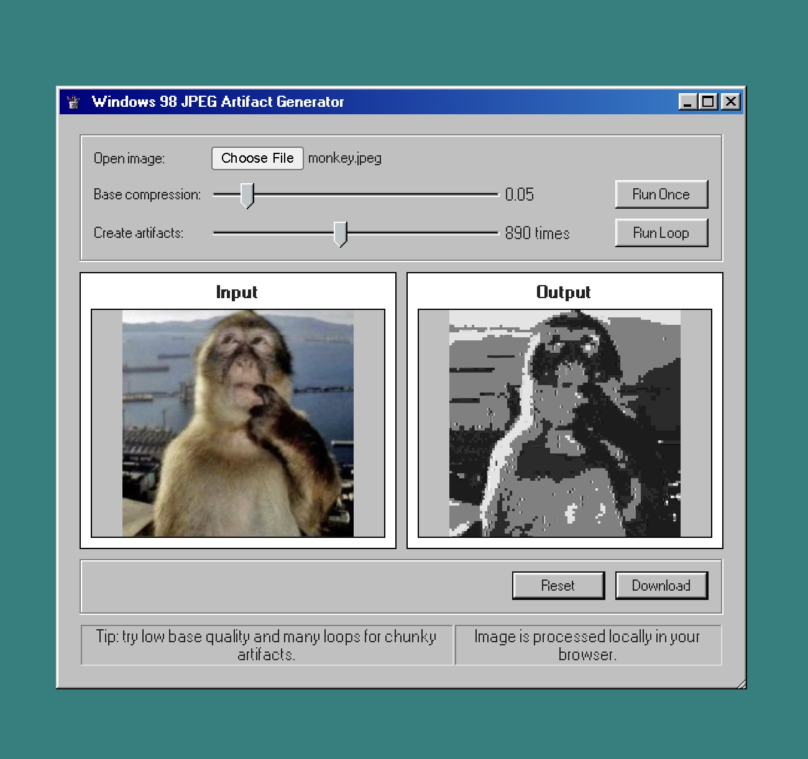

  

<h1 align="center">windows 98 jpeg artifact generator</h1>

  

---

## what is this?

have you ever wanted your images to look like they’ve been chilling on a myspace page since 2004 (yes YOU have), or even simulate an image thats been sent from an android to an iphone on sms?
i wanted to deep fry some pics for my retro-style [portfolio](https://hritish.com), but every tool out there was either too clean or had too many steps to achieve this effect.  
so i made this: a windows 98-style jpeg compressor that lets you absolutely destroy your images, right in your browser.

---

## features

- drag & drop or open any image
- **base compression** slider: lower it for more chunky blocks and jpeg chaos
- **loop** slider: run the compression over and over for that “sent through 12 forums and 3 instant messengers” look
- see input and output side by side
- download your cursed creation
- works on desktop and mobile
- all processing is done locally on your browser

---

## screenshots

  
  
  

---

## how to use

1. open an image (drag it in or use the file picker).
2. play with the sliders:
   - **base compression:** lower = more blocks, more chaos.
   - **loop count:** more loops = more artifacting, more “what even is this anymore”.
3. hit "run loop" and watch your image get deep fried in real time.
4. download and enjoy your new masterpiece, ready for your next retro website or cursed meme.

> **pro tip:**  
> turn the quality all the way down and loop it for a while to straight up deep-fry your images

---

## why?

because there wasn’t a site that just did this, and i wanted one.

---

## built with

- [svelte](https://svelte.dev/) for the ui
- [98.css](https://jdan.github.io/98.css/) for that sweet windows 98 look
- 100% client-side, hosted on github pages

---

## license

MIT

---

  <a href="https://github.com/hritsh/jpeg98" title="github repo">
    
    github.com/hritsh/jpeg98
  </a>

